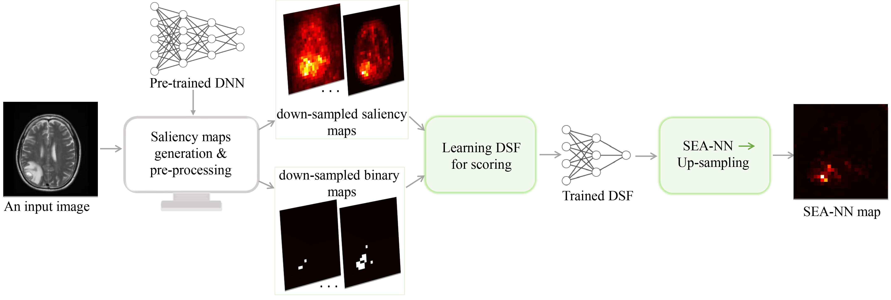

# Improving Attribution Methods by Learning Submodular Functions 
### Accepted at the 25th International Conference on Artificial Intelligence and Statistics ([AISTATS '22](https://aistats.org/aistats2022/cfp.html)). 
#### Piyushi Manupriya, [Tarun Ram Menta](https://github.com/peppermenta), [J. Saketha Nath](https://www.iith.ac.in/~saketha/), [Vineeth N Balasubramanian](https://www.iith.ac.in/~vineethnb/index.html)

*This work explores the novel idea of learning a submodular scoring function to **improve the specificity** of existing feature attribution methods. A **novel formulation for  learning a deep submodular set function** that is consistent with the real-valued attribution maps obtained by existing attribution methods is proposed. The final attribution    value of a feature is then defined as the marginal gain in the induced submodular score of the feature in the context of other highly attributed features, thus decreasing the  attribution of redundant yet discriminatory features. Experiments on multiple datasets illustrate that the proposed attribution method **achieves higher specificity along with   good discriminative power**.*

[Link to previous version of the paper](http://interpretable-ml.org/icml2020workshop/pdf/29.pdf) accepted at ICML '20 workshops (XXAI, WHI).

#### Acknowledgements
The first author is especially grateful to the mentorship of [Dr Bilal Alsalakh](https://scholar.google.com/citations?user=0TZaxxwAAAAJ&hl=en&oi=ao) and for being supported by the Google PhD Fellowship.
